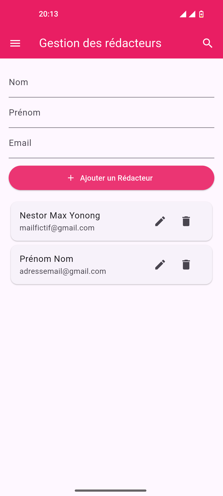

# Magazine Infos

Application Flutter de gestion des rédacteurs d'un magazine. Elle permet d'ajouter, consulter, modifier et supprimer des rédacteurs dans une base de données locale SQFLite, avec une interface simple et ergonomique en Material Design.

## Contexte du projet

Ce projet a été réalisé dans le cadre de la formation **D-CLIC — Cours Développement Mobile, Niveau Intermédiaire**, à l'occasion de l'**Activité guidée n°5 : « Gestion des données locales avec SqfLite »**.

L'énoncé propose un scénario métier : l'éditeur en chef du magazine numérique fictif **« Magazine Infos »** souhaite disposer d'un outil simple pour gérer ses rédacteurs — les personnes qui écrivent le contenu du magazine. L'application développée ici répond à ce besoin en permettant d'ajouter, afficher, modifier et supprimer les rédacteurs enregistrés, avec un stockage entièrement local (aucune dépendance à un serveur distant).

### Objectifs pédagogiques de l'activité

- Créer un modèle de données en Dart.
- Initialiser une base de données SQLite dans une application Flutter.
- Effectuer les opérations CRUD complètes : Create, Read, Update, Delete.
- Afficher dynamiquement des données dans une interface Flutter.
- Utiliser des champs de saisie, des listes (`ListView.builder`) et des boîtes de dialogue (`AlertDialog`) pour interagir avec les données.
- Charger automatiquement les données existantes au démarrage de l'application (via `initState()`).

### Compétences visées

Modélisation des données, opérations CRUD, widgets Flutter, stockage local, boîtes de dialogue, `ListView.builder`.

## Objectif

Cette application sert de gestionnaire interne pour enregistrer les informations de base des rédacteurs, notamment :

- nom
- prénom
- email

L'objectif est de centraliser les données localement sans dépendre d'un backend externe.

## Fonctionnalités

- Ajout d'un rédacteur via un formulaire
- Consultation de la liste des rédacteurs enregistrés
- Modification d'un rédacteur existant
- Suppression d'un rédacteur (avec confirmation)
- Chargement automatique de la liste des rédacteurs dès l'ouverture de l'application
- Stockage local via SQFLite
- Interface utilisateur responsive et fluide sur mobile / desktop via Flutter

## Stack technique

- Flutter
- Dart
- SQLite via `sqflite`
- `path` pour la gestion des chemins de fichiers
- Material 3

## Structure du projet

```text
magazine_infos/
├── android/
├── ios/
├── lib/
│   ├── main.dart
│   ├── modele/
│   │   └── redacteur.dart
│   ├── services/
│   │   └── database_manager.dart
│   └── views/
│       └── redacteur_interface.dart
├── test/
├── pubspec.yaml
├── analysis_options.yaml
├── README.md
└── ...
```

### Détails principaux

- `lib/main.dart` : point d'entrée de l'application
- `lib/modele/redacteur.dart` : modèle `Redacteur`
- `lib/services/database_manager.dart` : gestion de la base SQFLite
- `lib/views/redacteur_interface.dart` : interface utilisateur pour la gestion des rédacteurs

## Prérequis

- Flutter SDK 
- VS Code avec les extensions Flutter et Dart
- Un appareil physique ou un émulateur Android / iOS

## Installation

1. Clonez le projet :

```bash
git clone <url-du-projet>
cd magazine_infos
```
[Guide officiel pour cloner un projet](https://docs.github.com/fr/repositories/creating-and-managing-repositories/cloning-a-repository)

2. Installez les dépendances :

```bash
flutter pub get
```

## Lancement

Pour démarrer l'application :

```bash
flutter run
```

> **Remarque** : cette application utilise `sqflite`, qui repose sur SQLite natif. Elle doit être lancée sur un émulateur Android/iOS ou un appareil physique — elle ne fonctionne pas sur navigateur web (Chrome/Edge).

## Utilisation

1. Ouvrez l'application.
2. Remplissez les champs : nom, prénom et email.
3. Cliquez sur le bouton "Ajouter un Rédacteur".
4. La liste des rédacteurs est mise à jour automatiquement.
5. Vous pouvez modifier ou supprimer un élément depuis les actions associées à chaque carte.

## Base de données

La base SQFLite est créée automatiquement au premier lancement. Elle contient une table nommée `redacteurs` avec les colonnes suivantes :

- `id` : identifiant unique (clé primaire, auto-incrémentée)
- `nom` : nom du rédacteur
- `prenom` : prénom du rédacteur
- `email` : adresse email

## Capture d'écran



## Développements futurs possibles

- ajout d'une recherche par nom ou prénom
- validation stricte des emails
- support de photo/avatar
- export/import des données
- connexion vers un backend distant

## Remarque

Ce projet est une application locale de démonstration / gestion métier simple, réalisée à des fins pédagogiques dans le cadre de la formation D-CLIC. Il est conçu pour être facilement extensible selon les besoins d'un magazine ou d'un système interne de gestion des contributeurs.